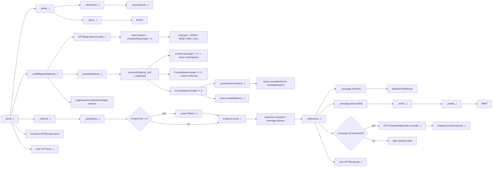

# LayerZero V2 OFT Review

This repository contains my review notes on the LayerZero V2 OFT path.

## What Is LayerZero OFT?

LayerZero V2 OFT is an omnichain token model.

At a high level, it allows token value to move from one chain to another through a send/receive path:

- value leaves the source-side token path
- a cross-chain message carries the transfer semantics through LayerZero delivery
- value is credited on the destination-side token path

In the plain OFT model reviewed here, the token itself owns that cross-chain send/receive logic.

## What This Review Covers

LayerZero V2 OFT moves token value across chains through an omnichain token model.

In the reviewed OFT path:

- on send, the source-side amount is debited and encoded into an outbound cross-chain message
- after transport delivery, the destination-side amount is credited through the OFT receive path
- if compose mode is enabled, the receive side can continue into an additional compose branch

This review is focused on the OFT contract / application layer path.

## Main Flow

## Scope

My current scope here is:

- OFT source-side send logic
- debit / amount-normalization logic
- outbound message construction
- options construction and enforced-options merge logic
- transport-facing send handoff into the LayerZero endpoint
- destination-side receive and credit logic
- optional compose continuation activation
- surrounding config, admin, preview, and helper surface

This review is focused on the contract / application layer rather than a deeper transport-layer review of LayerZero endpoint internals. Because of that, endpoint-level message-delivery internals are treated here only as the transport boundary between the reviewed source-side and destination-side OFT paths.

## OFT vs OFTAdapter

- `OFT` means the token itself is omnichain-aware and owns the cross-chain send/receive logic.
- `OFTAdapter` means an existing token is connected to omnichain transfer logic through a separate adapter contract.

This repository is focused on the `OFT` path.

## Review Structure

- [send-review.md](./send-review.md)
  Main OFT flow review covering the send path, transport boundary, receive path, destination-side credit, and compose continuation branch.

- [out-of-flow-review.md](./out-of-flow-review.md)
  Review of the surrounding config, admin, preview, and helper surface around the main OFT path.
