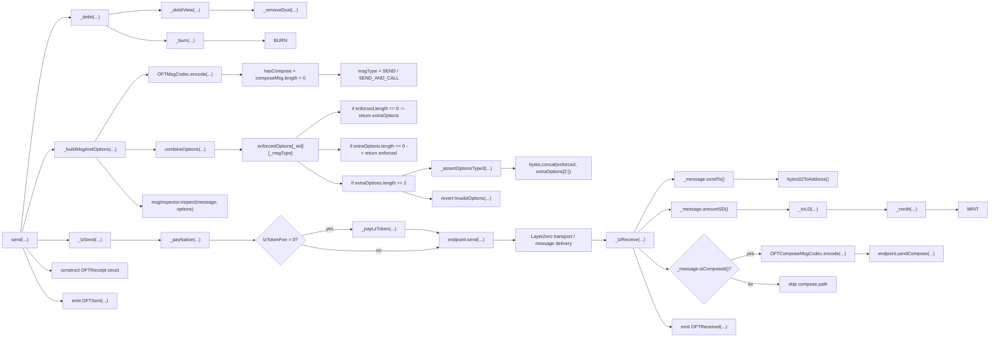

# Send Review

## Flow



`LayerZero transport / message delivery` is shown here only as the transport segment of the full OFT path. Endpoint-level message-delivery internals are outside my current review scope.

## 1. OFTCore.send(...)

```solidity
function send(
    SendParam calldata _sendParam,
    MessagingFee calldata _fee,
    address _refundAddress
) external payable virtual returns (MessagingReceipt memory msgReceipt, OFTReceipt memory oftReceipt) {
    (uint256 amountSentLD, uint256 amountReceivedLD) = _debit(
        msg.sender,
        _sendParam.amountLD,
        _sendParam.minAmountLD,
        _sendParam.dstEid
    );

    (bytes memory message, bytes memory options) = _buildMsgAndOptions(_sendParam, amountReceivedLD);

    msgReceipt = _lzSend(_sendParam.dstEid, message, options, _fee, _refundAddress);

    oftReceipt = OFTReceipt(amountSentLD, amountReceivedLD);

    emit OFTSent(msgReceipt.guid, _sendParam.dstEid, msg.sender, amountSentLD, amountReceivedLD);
}
```

What it does:

- starts the source-side OFT path
- resolves the debit result
- builds outbound message and options
- forwards the payload into the LayerZero transport-facing send step
- returns local send-side receipts

Invariants:

- source-side accounting must complete before the cross-chain message is sent
- the processed transfer amount must survive into outbound message construction
- recipient semantics must survive into outbound message construction
- destination-chain selection must remain consistent through the send path
- the same message and options pair must survive from build to inspect to send
- fee-payment mode must remain consistent until the actual payment or forwarding step
- the emitted send event must reflect the same flow semantics that actually went through the path

## 2. OFTCore._debit(...)

```solidity
function _debit(
    address _from,
    uint256 _amountLD,
    uint256 _minAmountLD,
    uint32 _dstEid
) internal virtual override returns (uint256 amountSentLD, uint256 amountReceivedLD) {
    (amountSentLD, amountReceivedLD) = _debitView(_amountLD, _minAmountLD, _dstEid);
    _burn(_from, amountSentLD);
}
```

What it does:

- derives the normalized debit result
- burns the source-side amount from `_from`

Invariants:

- burn must match the debit result that `_debit(...)` just derived

## 3. OFTCore._debitView(...)

```solidity
function _debitView(
    uint256 _amountLD,
    uint256 _minAmountLD,
    uint32 /*_dstEid*/
) internal view virtual returns (uint256 amountSentLD, uint256 amountReceivedLD) {
    amountSentLD = _removeDust(_amountLD);
    amountReceivedLD = amountSentLD;

    if (amountReceivedLD < _minAmountLD) {
        revert SlippageExceeded(amountReceivedLD, _minAmountLD);
    }
}
```

What it does:

- normalizes the source-side amount
- derives the destination-visible amount
- enforces the minimum accepted received amount

Invariants:

- `amountReceivedLD` must not exceed the normalized debit result

Weak invariants:

- minimum output protection via `_minAmountLD`

## 4. OFTCore._buildMsgAndOptions(...)

```solidity
function _buildMsgAndOptions(
    SendParam calldata _sendParam,
    uint256 _amountLD
) internal view virtual returns (bytes memory message, bytes memory options) {
    bool hasCompose;

    (message, hasCompose) = OFTMsgCodec.encode(
        _sendParam.to,
        _toSD(_amountLD),
        _sendParam.composeMsg
    );

    uint16 msgType = hasCompose ? SEND_AND_CALL : SEND;

    options = combineOptions(_sendParam.dstEid, msgType, _sendParam.extraOptions);

    if (msgInspector != address(0)) {
        IOAppMsgInspector(msgInspector).inspect(message, options);
    }
}
```

What it does:

- builds the outbound OFT message payload
- derives message type from compose or non-compose mode
- merges user options with enforced options
- optionally runs the message inspector

Invariants:

- recipient semantics must survive into outbound message payload
- processed amount must survive into outbound message payload
- message type must stay aligned with compose or non-compose mode
- destination-chain selection must survive into options-building step

## 5. OFTMsgCodec.encode(...)

```solidity
function encode(
    bytes32 _sendTo,
    uint64 _amountShared,
    bytes memory _composeMsg
) internal view returns (bytes memory _msg, bool hasCompose) {
    hasCompose = _composeMsg.length > 0;

    _msg = hasCompose
        ? abi.encodePacked(_sendTo, _amountShared, addressToBytes32(msg.sender), _composeMsg)
        : abi.encodePacked(_sendTo, _amountShared);
}
```

What it does:

- encodes the outbound OFT message
- decides whether compose mode is active
- includes sender context when compose payload exists

Invariants:

- compose mode must not activate unless compose payload actually exists

## 6. combineOptions(...)

```solidity
function combineOptions(
    uint32 _eid,
    uint16 _msgType,
    bytes calldata _extraOptions
) public view virtual returns (bytes memory) {
    bytes memory enforced = enforcedOptions[_eid][_msgType];

    if (enforced.length == 0) return _extraOptions;
    if (_extraOptions.length == 0) return enforced;

    if (_extraOptions.length >= 2) {
        _assertOptionsType3(_extraOptions);
        return bytes.concat(enforced, _extraOptions[2:]);
    }

    revert InvalidOptions(_extraOptions);
}
```

What it does:

- loads enforced options for the selected destination and message type
- merges them with user-supplied extra options
- rejects invalid option format

Invariants:

- enforced options for the selected destination and message type must not be silently skipped

Weak invariants:

- invalid extra-options format must not be merged

## 7. OFTCore._lzSend(...)

```solidity
function _lzSend(
    uint32 _dstEid,
    bytes memory _message,
    bytes memory _options,
    MessagingFee memory _fee,
    address _refundAddress
) internal virtual returns (MessagingReceipt memory receipt) {
    uint256 messageValue = _payNative(_fee.nativeFee);

    if (_fee.lzTokenFee > 0) _payLzToken(_fee.lzTokenFee);

    return endpoint.send{ value: messageValue }(
        MessagingParams(
            _dstEid,
            _getPeerOrRevert(_dstEid),
            _message,
            _options,
            _fee.lzTokenFee > 0
        ),
        _refundAddress
    );
}
```

What it does:

- processes the transport-facing payment path
- optionally pays LayerZero token fee
- forwards the outbound payload into `endpoint.send(...)`
- targets the configured peer for `_dstEid`

Invariants:

- native fee semantics must remain consistent into `endpoint.send(...)` value forwarding
- the transport send must target the configured peer for the selected destination chain

Weak invariants:

- token-fee mode should only activate when the current message uses token-fee payment
- message and options payloads should survive unchanged from `_lzSend(...)` input into `endpoint.send(...)`

## 8. OFTCore._payLzToken(...)

```solidity
function _payLzToken(uint256 _lzTokenFee) internal virtual {
    address lzToken = endpoint.lzToken();
    if (lzToken == address(0)) revert LzTokenUnavailable();

    IERC20(lzToken).safeTransferFrom(msg.sender, address(endpoint), _lzTokenFee);
}
```

What it does:

- resolves the currently configured LayerZero fee token
- transfers the fee token from caller to the endpoint

Invariants:

- token-fee payment must not proceed without a configured `lzToken`
- token-fee transfer must debit caller in configured `lzToken` and credit endpoint path, not arbitrary path

## 9. OFTCore._lzReceive(...)

```solidity
function _lzReceive(
    Origin calldata _origin,
    bytes32 _guid,
    bytes calldata _message,
    address /*_executor*/,
    bytes calldata /*_extraData*/
) internal virtual override {
    address toAddress = _message.sendTo().bytes32ToAddress();

    uint256 amountReceivedLD = _credit(
        toAddress,
        _toLD(_message.amountSD()),
        _origin.srcEid
    );

    if (_message.isComposed()) {
        bytes memory composeMsg = OFTComposeMsgCodec.encode(
            _origin.nonce,
            _origin.srcEid,
            amountReceivedLD,
            _message.composeMsg()
        );

        endpoint.sendCompose(
            toAddress,
            _guid,
            0,
            composeMsg
        );
    }

    emit OFTReceived(_guid, _origin.srcEid, toAddress, amountReceivedLD);
}
```

What it does:

- receives the inbound OFT message after the transport segment
- resolves destination recipient and destination-side amount
- forwards the amount into the destination-side credit step
- optionally activates the compose continuation branch

Invariants:

- recipient semantics from inbound message must survive into credit step
- normalized transfer amount must survive from inbound message into destination-side credit
- compose continuation must not activate unless inbound message actually carries compose payload

Weak invariants:

- the receive event should reflect the actual receive path

## 10. OFTCore._credit(...)

```solidity
function _credit(
    address _to,
    uint256 _amountLD,
    uint32 /*_srcEid*/
) internal virtual override returns (uint256 amountReceivedLD) {
    if (_to == address(0x0)) _to = address(0xdead);

    _mint(_to, _amountLD);

    return _amountLD;
}
```

What it does:

- performs the destination-side token credit
- normalizes zero-address credit into `address(0xdead)`
- finalizes the asset movement on the receive side

Invariants:

- destination-side mint must target the resolved recipient that the credit path ended with
- minted amount must match the credit amount that `_credit(...)` accepted

## 11. OFTComposeMsgCodec.encode(...)

```solidity
function encode(
    uint64 _nonce,
    uint32 _srcEid,
    uint256 _amountLD,
    bytes memory _composeMsg
) internal pure returns (bytes memory _msg) {
    _msg = abi.encodePacked(_nonce, _srcEid, _amountLD, _composeMsg);
}
```

What it does:

- encodes the compose continuation payload
- preserves the continuation context for the downstream compose branch

Invariants:

- compose payload must preserve the continuation context that the downstream compose path depends on
